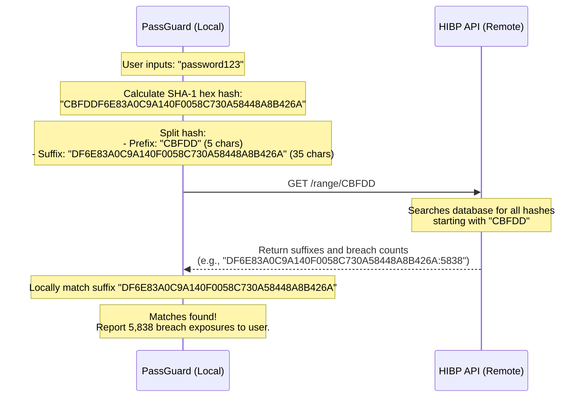

# PassGuard - Password Security Analyzer CLI Tool

PassGuard is a modular Python command-line interface (CLI) tool designed to analyze and audit password security. It evaluates password strength using information-theoretic entropy, scans for common predictable keyboard/sequential patterns, checks against a local dictionary of the top 10,000 most common credentials, and checks for public breaches using the Have I Been Pwned API securely via the **k-Anonymity** privacy model.

---

## Key Features

1. **Password Strength Analysis**:
   - **Shannon Entropy Calculation**: Computes password strength in bits dynamically based on character variety (lowercase, uppercase, digits, and special symbols) and length ($H = L \log_2 R$).
   - **Length Evaluation**: Flags passwords of unsafe length with tiered severity levels (`CRITICAL` for $<8$ characters, `WARNING` for $<12$ characters, `OK` for $12-15$, and `SAFE` for $\ge 16$).
   - **Predictable Pattern Scanning**: Identifies sequential strings (e.g., `abc`, `123`), repeated characters (e.g., `aaa`), and adjacent keyboard runs (e.g., `qwerty`, `asdf`) which compromise real-world security.
   - **Local 10k Dictionary Checking**: Automatically downloads and checks against the top 10,000 most common passwords list from Daniel Miessler's SecLists (cached locally).

2. **Secure Breach Check (Have I Been Pwned API)**:
   - Queries the public API using the **k-Anonymity model** to check if the password was leaked in data breaches.
   - **No API key or signup** required.

3. **High-Quality CLI Interface**:
   - **Interactive Mode**: Prompts securely with hidden inputs using Python's standard `getpass`.
   - **Bulk Auditing Mode**: Analyzes passwords in bulk from a text file, displaying a formatted summary table.
   - **Rich Terminal Styling**: Leverages `rich` to render colored logs, panels, progress bars, and tables.

4. **Detailed Audit Reporting**:
   - Outlines specific weaknesses and lists **2 to 3 actionable suggestions** for improvement.
   - Exports results to **CSV** or **JSON** (fingerprinted and masked for safety).

---

## How k-Anonymity Protects User Privacy

A primary concern when checking passwords against a breach database is the leak of the password itself to the service provider or to network eavesdroppers. **PassGuard strictly avoids sending your actual password or even its full hash to any external server.**

Instead, it implements the **k-Anonymity model**:



1. **Local Hashing**: PassGuard calculates the standard SHA-1 hash of the password locally.
2. **First 5 Characters**: Only the first 5 hexadecimal characters of the hash (representing 20 bits of entropy) are sent to the Have I Been Pwned API.
3. **Anonymity Set**: The API searches its database and returns a list of all hash suffixes matching that 5-character prefix (typically between 400 to 1,000 suffixes). The API server **never** learns which of these suffixes is yours, meaning the password remains fully anonymous.
4. **Local Matching**: PassGuard checks the returned suffixes locally to see if your password's suffix is in the results and reports the breach count.

---

## Installation & Setup

1. **Clone or copy** the codebase into your workspace directory.
2. Ensure you have **Python 3.8+** installed.
3. Install dependencies from `requirements.txt`:
   ```bash
   pip install -r requirements.txt
   ```

---

## Usage Guide

### 1. Interactive Single Password Check
Run the entrypoint script without arguments to analyze a password interactively:
```bash
python passguard.py
```
*You will be prompted to enter the password (hidden as you type).*

**Example CLI Output:**
```
=======================================================
[PASSGUARD] Password Security Analyzer CLI Tool
=======================================================

Enter password to analyze (input will be hidden):

┌──────────────────────────────────────────────────────────┐
│ Analysis Report                                          │
├──────────────────────────────────────────────────────────┤
│ Masked Password: p*********3 (len: 11)                   │
│ Strength Score: Weak                                     │
│ Entropy: 37.6 bits                                       │
│ Breach Lookup: BREACHED (52,372,427 times in leaks)      │
│                                                          │
│ Detected Weaknesses:                                     │
│   * Too short (less than 12 characters)                  │
│   * Found in list of top 10,000 common passwords         │
│   * Exposed in public data breaches (52,372,427 times)   │
│                                                          │
│ Actionable Recommendations:                              │
│   * Stop using this password immediately; it is          │
│     compromised in data breaches.                        │
│   * Choose a unique password; this is in the top 10,000  │
│     most commonly used passwords.                        │
│   * Increase the length to at least 12 characters.       │
└──────────────────────────────────────────────────────────┘
```

### 2. Bulk Password Auditing
Audit multiple passwords stored in a file (one password per line):
```bash
python passguard.py -b path/to/passwords.txt
```

### 3. Bulk Auditing with JSON/CSV Export
Audit passwords and save reports to standard CSV or JSON formats for further processing. **The actual passwords are never written to disk** (they are masked and fingerprinted with SHA-256 for safe identification):
```bash
python passguard.py -b path/to/passwords.txt -c audit_report.csv -j audit_report.json
```

### 4. Skip Breach Database Check (Offline Mode)
For offline audits or strict environment policies, you can skip external API requests:
```bash
python passguard.py -b path/to/passwords.txt --no-breach
```

### 5. Force Database Download
Force download the latest copy of Daniel Miessler's top 10k common password list:
```bash
python passguard.py --force-download
```

## Chrome Extension

PassGuard is also available as a lightweight, visual Google Chrome extension inside the `extension/` directory. It offers live, secure, offline-first analysis as you type.

### Installation Instructions
1. Open Google Chrome and navigate to `chrome://extensions/`.
2. Enable **Developer mode** by clicking the toggle switch in the top-right corner.
3. Click the **Load unpacked** button in the top-left corner.
4. Select the `extension` folder located inside this project directory (`c:\Users\Public\CS_Project\PassGuard\extension`).
5. PassGuard will now appear in your browser's extension toolbar. Pin it for quick access!

### Visual Interface Features
- **Real-time Scoring**: Automatically calculates and categorizes strength (Very Weak to Very Strong) using color-coded metrics.
- **Dynamic Gauge**: Graphic progress bar displaying strength level instantly.
- **Hidden Input Toggle**: Easily show or hide password input using the eye button.
- **k-Anonymity Breach Check**: Sends only the first 5 characters of the password's SHA-1 hash to the Have I Been Pwned API, protecting user anonymity entirely in browser space.

---

## Project Structure

- [passguard.py](file:///c:/Users/Public/CS_Project/PassGuard/passguard.py): Main CLI entrypoint script.
- [passguard/entropy.py](file:///c:/Users/Public/CS_Project/PassGuard/passguard/entropy.py): Functions to calculate entropy and inspect character pool sizes.
- [passguard/patterns.py](file:///c:/Users/Public/CS_Project/PassGuard/passguard/patterns.py): Checks for sequential keyboard rows, digits, alphabetical runs, and repetitions.
- [passguard/breach.py](file:///c:/Users/Public/CS_Project/PassGuard/passguard/breach.py): k-Anonymity Have I Been Pwned API client logic.
- [passguard/common.py](file:///c:/Users/Public/CS_Project/PassGuard/passguard/common.py): Caching downloader and set checker for top 10,000 common passwords.
- [passguard/reporter.py](file:///c:/Users/Public/CS_Project/PassGuard/passguard/reporter.py): Integrates all audit layers, handles CSV/JSON report exports, and masks passwords.
- [passguard/cli.py](file:///c:/Users/Public/CS_Project/PassGuard/passguard/cli.py): CLI interface rendering, argparsing, and console progress tracking.
- [extension/manifest.json](file:///c:/Users/Public/CS_Project/PassGuard/extension/manifest.json): Extension configuration (Manifest V3).
- [extension/popup.html](file:///c:/Users/Public/CS_Project/PassGuard/extension/popup.html): Interactive Extension popup dashboard.
- [extension/popup.css](file:///c:/Users/Public/CS_Project/PassGuard/extension/popup.css): Glassmorphic styling definitions.
- [extension/popup.js](file:///c:/Users/Public/CS_Project/PassGuard/extension/popup.js): Cryptography, pattern evaluation, HIBP fetching, and UI binding scripts.
- [extension/common_passwords.txt](file:///c:/Users/Public/CS_Project/PassGuard/extension/common_passwords.txt): Pre-loaded offline 10k common password dictionary.

